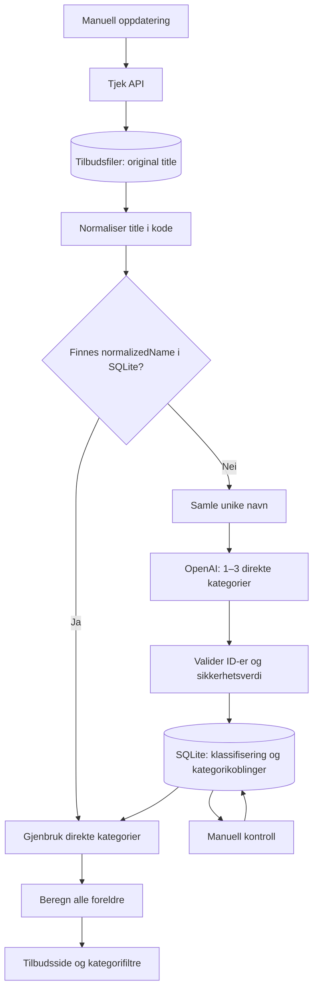

# Ukeshandel.no

Henter tilbud fra Tjek, gjenbruker lagret kategorisering og bruker OpenAI for nye varenavn. Forsiden, tilbudskortene, søk, filtre og admin er beholdt.

## Start og bruk

Start med `run-app.bat`, eller kjør `npm run dev` i backend og frontend. Frontend bruker http://localhost:5173 og backend port 5000. Admin åpnes på `/admin` med det eksisterende lokale passordet `a`.

1. Trykk «Hent og kategoriser tilbud» i admin.
2. Kontroller usikre forslag, også historiske navn og migreringskonflikter.
3. Velg 1–3 direkte kategorier og lagre. Rettelsen gjelder samme normaliserte navn på tvers av butikker.
4. «Vis alle» og søk lar deg rette også resultater som ikke ligger i kontrollkøen.
5. På `/kategorier` kan du opprette, omdøpe, flytte og slette kategorier.

`OPENAI_API_KEY` legges i backend/.env. `SKIP_AI=true` deaktiverer AI. Vanlig visning av tilbud gjør ingen Tjek- eller AI-kall. Det finnes ingen automatisk søndagsoppdatering.

## Én oppslagsnøkkel: normalizedName

Original `title` beholdes urørt. `normalizeTitle.ts` beregner `normalizedName`: små bokstaver, tegnsetting erstattet av mellomrom, sammenslåtte mellomrom og trimming. Ingen AI brukes til normalisering.

Eksempel: `  TINE   Mellommelk! ` gir `tine mellommelk`. Butikk, mengde, pris og periode inngår ikke i kategorioppslaget. Ulike navn for samme vare kan fortsatt gi ulike oppslag.

`productKey`, `categoryKey` og `ingredientKey` er fjernet fra aktiv kategorisering og API-modellen. Historiske tilbudsfiler kan fremdeles inneholde gamle felter; de utelates ved lesing. Nye tilbudsfiler lagrer ikke konstruerte produktnøkler. Andre tilbudsfelter som ID, tittel, pris, mengde, butikk, bilde og dato beholdes.

## Flere kategorier og automatisk arv

Kategorier lagres med stabil `id`, `name` og valgfri `parentId`. Samme navn kan forekomme under forskjellige foreldre; oppslag og koblinger bruker ID, ikke kategorinavn.

Et normalisert varenavn har en liste med direkte kategori-ID-er. Alle foreldre beregnes når kategoriene leses. Dermed fungerer også filtre på overordnede kategorier.

Eksempel med eksisterende kategorinavn:

```text
vegetarlasagne
  ├─ Ferdigretter → Middag (arves)
  └─ Vegetar
```

«Ferdigretter» under «Middag» er beholdt fra den eksisterende kategorilisten. «Vegetar» er lagt til som selvstendig kategori. Kategorier kan ha flere nivåer. Sykluser, ukjente foreldre og duplikater under samme forelder avvises.

Bare direkte kategorier lagres. Velges både en forelder og dens underkategori, beholdes bare underkategorien som direkte kobling. Omdøping beholder ID-en og alle koblinger. Flytting endrer arvede kategorier automatisk. Ved sletting merkes berørte navn for kontroll. Flytt eller slett underkategoriene før du sletter en forelder.

## AI og gjenbruk



- Identiske normaliserte navn i samme oppdatering sendes bare én gang.
- AI returnerer `normalizedName`, `categoryIds` og `confidence` (0–1).
- Kun eksisterende kategori-ID-er godtas. 1–3 forslag kreves; ukjente ID-er, duplikater og ugyldig sikkerhetsverdi avvises.
- Under 0,90 merkes for kontroll. Modellens egen sikkerhet er ikke dokumentert treffsikkerhet.
- Usikre, tomme og ugyldige svar lagres for kontroll og sendes ikke automatisk på nytt neste uke.
- Ved teknisk API-feil feiler oppdateringen; ubesvarte navn kan forsøkes ved neste manuelle oppdatering.
- AI overskriver ikke en eksisterende klassifisering, heller ikke en manuell rettelse som gjøres mens AI-kallet pågår.
- Foreldre velges ikke av AI; de beregnes av koden.

## Lagring og migrering

| Data | Plassering |
| --- | --- |
| Tilbud per butikk | backend/persistence/src/resources/offers/*_offers.json |
| Klassifisering, kategorier, koblinger og oppdateringsstatus | persistence/data/mattilbud.db |
| Gammelt kategorihierarki, kun førstegangsimport | backend/persistence/src/resources/categories.json |
| Butikker og Tjek-ID-er | backend/rest/src/config/stores.ts |

SQLite-tabeller:

- `categories`: kategori-ID, navn og forelder.
- `classifications`: ett oppslag per normalizedName, kilde og kontrollstatus.
- `classification_categories`: mange-til-mange-kobling mellom navn og direkte kategorier.
- `category_migration_conflicts`: eldre rader ved migreringskonflikter, for sporbarhet.
- `schema_migrations`: versjon og migreringsrapport.

Migreringen er additiv og transaksjonell. Den tar databasebackup og beholder `category_cache` og andre gamle tabeller som arkiv. De gamle tabellene brukes ikke til aktive oppslag. Manuelle rader prioriteres over AI. Motstridende kategoriseringer innen den prioriterte gruppen merkes for kontroll; ingen gamle kategoriseringer sendes til AI under migrering.

Resultat fra den lokale databasen: 2 582 gamle rader → 2 195 normaliserte navn. 115 manuelle rader er samlet i 107 manuelle navn. 44 navnekonflikter; totalt 46 navn krevde kontroll ved migrering. Dette er et historisk øyeblikksbilde, ikke løpende statistikk.

Fra backend:

- `npm run categories:preview`: prøv migrering på en midlertidig databasekopi og vis rapport/integritetskontroll.
- `npm run categories:migrate`: bruk migreringen på konfigurert database. Gjentatt kjøring endrer ikke allerede migrerte data.

Serveroppstart utfører samme migrering ved behov. Ikke kjør gammel og ny backend samtidig mot samme database. `DB_PATH`, `OFFERS_DIR` og `CATEGORIES_FILE` kan overstyres for isolerte miljøer. Etter migrering redigeres kategorier via appen, ikke JSON-filen.

## Viktige filer

| Ansvar | Fil |
| --- | --- |
| Normalisering | backend/core/src/utils/normalizeTitle.ts |
| Migrering | backend/core/src/db/categoryMigration.ts |
| Klassifiseringsoppslag | backend/core/src/db/categoryCacheRepo.ts |
| Kategorihierarki og validering | backend/core/src/config/categories.ts |
| AI-instruksjon og svarvalidering | backend/core/src/services/aiCategorization.ts |
| Gjenbruk og koordinering | backend/core/src/services/categoryService.ts |
| Oppdateringsjobb | backend/core/src/services/offerUpdateService.ts |
| API | backend/rest/src/routes/offers.ts |
| Tilbudsvisning | frontend/src/pages/OffersPage.tsx |
| Manuell kontroll | frontend/src/components/AdminReview.tsx |
| Flerkategorivalg | frontend/src/components/CategoryPicker.tsx |
| Kategoriadministrasjon | frontend/src/components/CategoryManager.tsx |

## API

| Metode | Adresse | Bruk |
| --- | --- | --- |
| GET | /api/offers | Lagrede tilbud, eventuelt ?store=Meny |
| POST | /api/offers/update | Hent og kategoriser |
| GET | /api/offers/review | Lagrede tilbud som trenger kontroll |
| GET | /api/classifications/review | Alle navn som trenger kontroll, inkludert historiske |
| POST | /api/offers/categorize | `{normalizedName, categoryIds: [...]}` |
| GET | /api/categories | `{categories: [{id,name,parentId}]}` |
| POST | /api/categories | Opprett med `{name,parentId}` |
| PUT | /api/categories/:id | Endre navn/forelder |
| DELETE | /api/categories/:id | Slett en kategori uten barn |
| GET | /api/admin/migration | Historisk migreringsrapport |

Tilbudssvar har `normalizedName`, `categoryIds` (direkte), `effectiveCategoryIds` (inkludert foreldre), `categories`, `categorySource`, `categoryConfidence`, `needsReview` og `reviewReason`. Gamle kategoriendepunkter basert på hoved-/underkategorinavn er erstattet av ID-baserte endepunkter.

## Kontroll og begrensninger

`npm test` og `npm run build` i backend; `npm run build` i frontend. Testene bruker egne databaser, lokale HTTP-kall og mockede AI-/Tjek-kall. Ingen eksterne AI-kall gjøres i testene.

Navnebasert gjenbruk er ingen sikker produktidentitet: generiske navn kan dekke forskjellige produkter. AI skal ikke gjette vegetar eller andre egenskaper uten grunnlag. Komplett katalogdekning, gyldighetsfiltrering og målt kategoriseringskvalitet gjenstår. Appen er satt opp for lokal bruk og har ikke serverautentisering.
